# 📘 GUÍA COMPLETA DEL SISTEMA — EL BLUX *Sabor de Casa*

Manual de uso de la aplicación de delivery, organizado **por rol**.
Sin registros complicados: el cliente pide sin cuenta y el personal entra con su correo.

## Contenido

- **Rol 1 · Cliente** — cómo pedir, pagar y seguir el delivery
- **Rol 2 · Administrador** — gestión total del negocio
- **Rol 3 · Cocina (tablet)** — cola de preparación
- **Rol 4 · Repartidor** — entregas, GPS y caja
- **Anexos** — reglas de la casa, preguntas frecuentes, soporte

---
---

# 🍗 ROL 1 · CLIENTE

*No necesita descargar nada ni crear cuenta. Solo entra al enlace.*

## 1.1 Portada (Inicio)

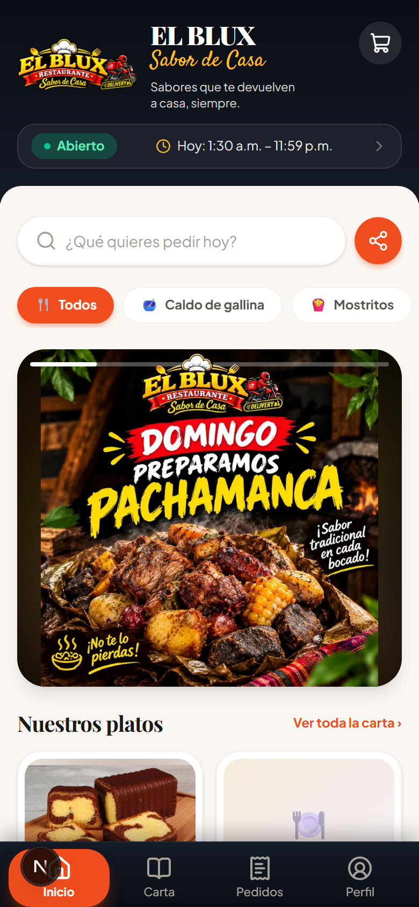

| # | Elemento | Qué hace |
|---|---|---|
| 1 | **Abierto / Cerrado** | El estado del negocio con su horario de hoy. Cerrado = no se puede pedir. |
| 2 | **Buscador** | Escribe el plato (caldo, mostrito…) y filtra al instante. |
| 3 | **Categorías** | Chips de colores para filtrar por tipo de plato. |
| 4 | **Promociones** | Carrusel de ofertas del día. Avanza sola cada 5 segundos; toca los lados para navegar. |
| 5 | **Compartir** (botón naranja) | Manda la carta por WhatsApp a tus contactos. |
| 6 | **Barra inferior** | Inicio · Carta · Pedidos · Perfil. |

## 1.2 La Carta

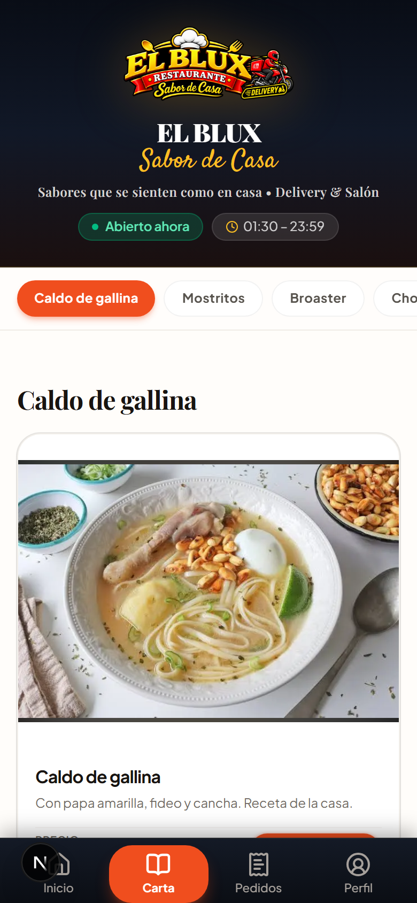

Todos los platos con **foto, nombre, descripción y precio**. Arriba, las categorías fijas para navegar con el dedo. Si un plato está agotado, aparece con cartel y no se puede pedir.

## 1.3 Agregar platos

Toca el botón naranja **🛒 Agregar** en cualquier plato. El ícono del carrito muestra cuántos llevas.

## 1.4 Tu carrito

Toca el 🛒 de arriba a la derecha:

- Cambia cantidades con **＋ / −**
- Elimina un plato con el ícono de basurero
- Mira el **subtotal + costo de delivery = total**
- Toca **"Ir a pagar"** para continuar

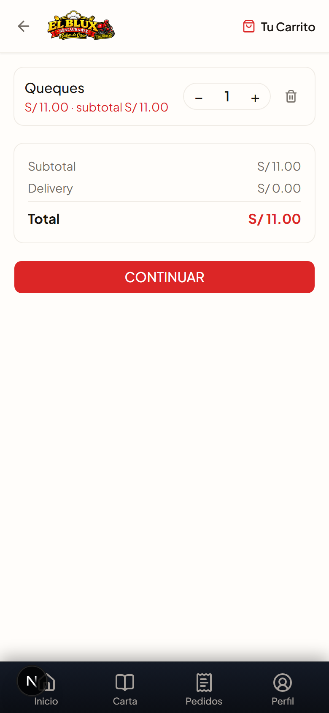

## 1.5 Datos de entrega y pago (Checkout)

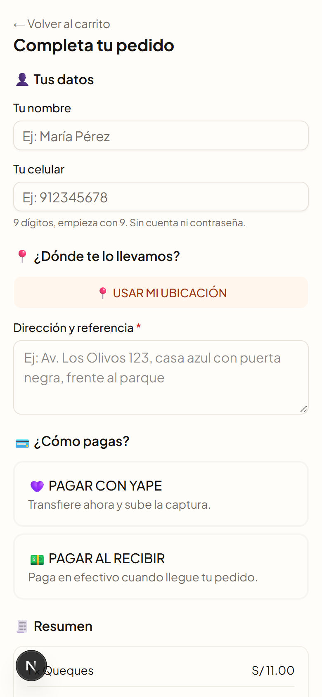

Paso a paso:

1. **👤 Tus datos**: nombre y celular (9 dígitos, empieza en 9). Se guardan en tu teléfono; la próxima vez ya están.
2. **📍 Ubicación**: botón "USAR MI UBICACIÓN" (acepta el permiso del navegador) + escribe la **referencia** de tu casa (obligatoria: color, puerta, frente a qué).
3. **💳 Pago**:
   - **PAGAR CON YAPE** 💜 → te muestra el número y QR del negocio. Transfiere y **sube la captura**.
   - **PAGAR AL RECIBIR** 💵 → pagas en efectivo cuando llegue el repartidor.
4. **✅ Marca la casilla** de Términos y Condiciones (sino no se puede guardar).
5. Toca **CONFIRMAR PEDIDO** → te da tu número de pedido y el enlace de seguimiento.

## 1.6 Seguimiento del pedido

En **🧾 Pedidos** (barra inferior) ves tus pedidos con su estado a color y su total. Al abrir uno:

- **Línea de estados en vivo**: 🆕 Recibido → ✅ Confirmado → 🔥 En preparación → ✅ Listo → 🛵 Asignado → 🛵 En camino → 🎉 Entregado
- **Cuando te asignan repartidor**: aparece su tarjeta con nombre, foto inicial y botón **💬 Chatear por WhatsApp**
- **Cuando sale en camino**: mapa en vivo con tu casa 🏠, la tienda 🏪 y la moto 🛵 moviéndose, con **tiempo estimado de llegada**

Se actualiza solo cada 30 segundos.

## 1.7 Cancelar un pedido

Dentro del seguimiento hay un botón **⛔ Cancelar pedido**:

| Si cancelas… | Pasa esto |
|---|---|
| Antes de entrar a cocina (Nuevo/Confirmado) | ✅ Gratis. Sin recargo ni castigo. |
| Ya en preparación, listo o en camino | ⚠️ Se cancela, pero tu número queda **suspendido**: tu próximo pedido será rechazado hasta que contactes a soporte y pagues el gasto + S/5 de reactivación. |
| Ya entregado | No se puede. |

## 1.8 Tu Perfil

- Te saluda por tu nombre
- **Modificar** tus datos y guardarlos de nuevo (pidiendo otra vez la casilla de términos)
- **📲 Instalar la app**: aparece como ícono en tu pantalla de inicio
- **Ver mis pedidos anteriores**
- Abajo, el enlace discreto *"Acceso personal"* (para el staff)

---
---

# 🔐 ROL 2 · ADMINISTRADOR

*Entra en `/admin/login` con su correo y contraseña. Si marca “Guardar mi sesión”, la próxima vez entra directo.*

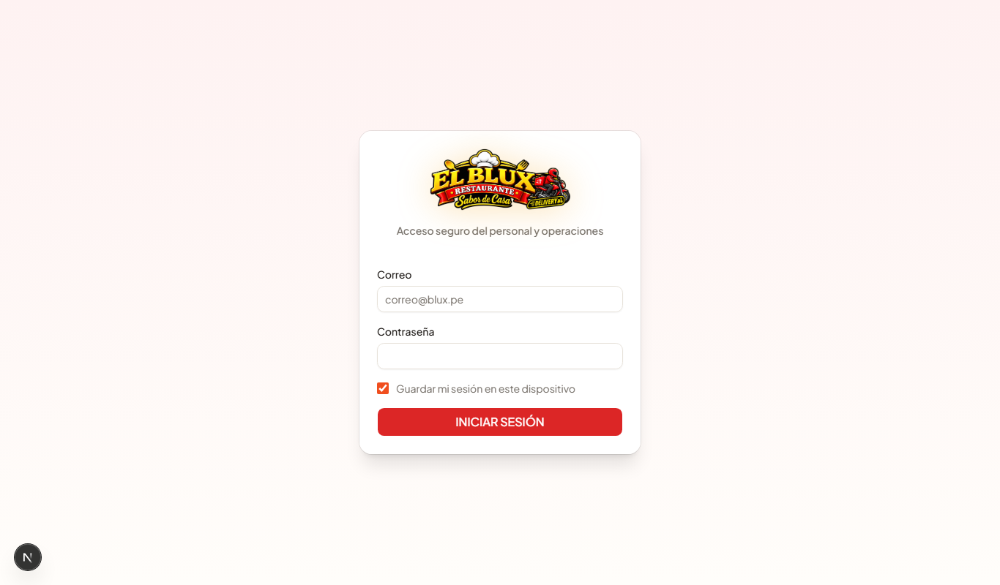

**En computadora** aparece la barra lateral oscura a la izquierda. **En celular**, la barra inferior naranja.

## 2.1 Inicio del panel

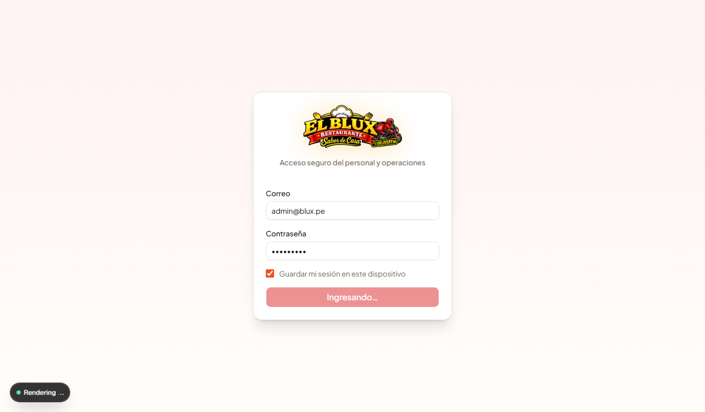

Resumen del día en tiempo real: pedidos de hoy, monto vendido, y despacho. Aquí también aparece la tarjeta **"💵 Efectivo por recibir"** cuando un repartidor declara que te va a entregar dinero: ves el detalle (qué pedidos, cuánto) y tocas **✅ Recibí** cuando lo tengas en la mano.

## 2.2 Pedidos (el corazón del negocio)

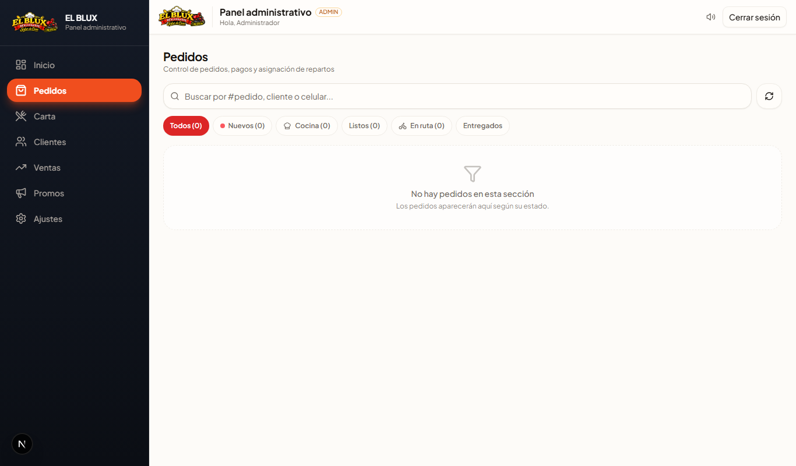

- **Filtros por estado**: Todos / Nuevos / Cocina / Listos / En ruta / Entregados / y buscador por número, cliente o celular
- Tocas un pedido y ves: ítems, total, **comprobante de Yape** (para aprobar/rechazar), cliente con botón WhatsApp, **QUIÉN lo llevó** (repartidor asignado) y **mapa con la dirección**
- Acciones: **Confirmar → En preparación → Listo → Asignar repartidor → Entregado** (o ⛔ Cancelar)

## 2.3 Carta (productos)

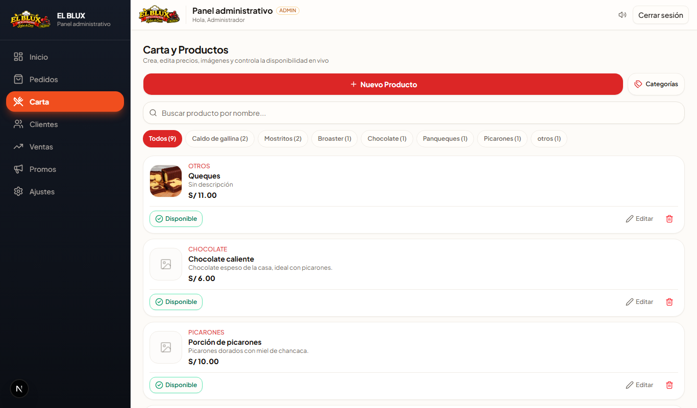

Crear y editar platos: nombre, descripción, precio, categoría, foto, y si está disponible. El toggle **agotado** lo quita del cliente al instante.

## 2.4 Categorías

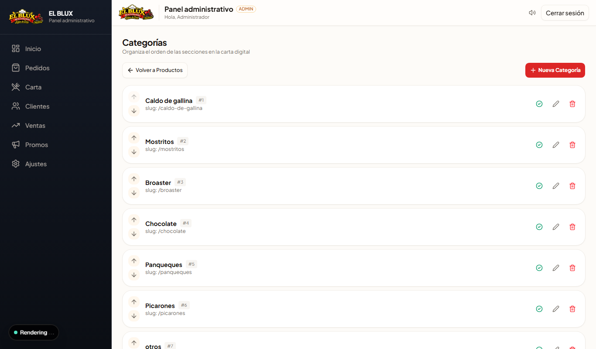

Orden y nombre de los chips de la carta (Caldos, Mostritos, Postres…).

## 2.5 Clientes

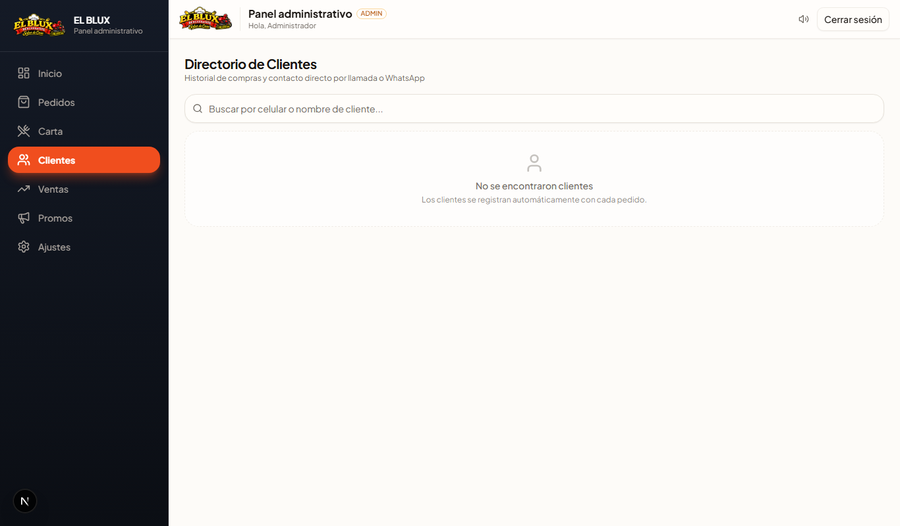

Historial de cada cliente (pedidos, gasto total), botones para llamar o WhatsApp. Si un cliente está **🔒 Suspendido** (por cancelar tarde), aquí ves cuánto debe y tocas **Reactivar** cuando te pague.

## 2.6 Ventas

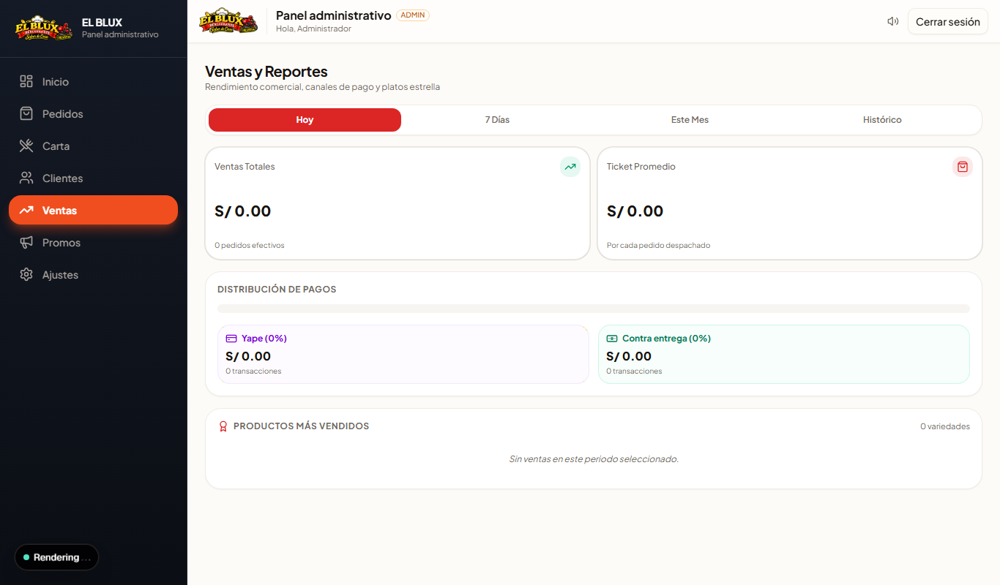

Resumen del día: total vendido, cantidad de pedidos, por método de pago. Sirve para cuadrar la caja al cerrar.

## 2.7 Promociones (banner)

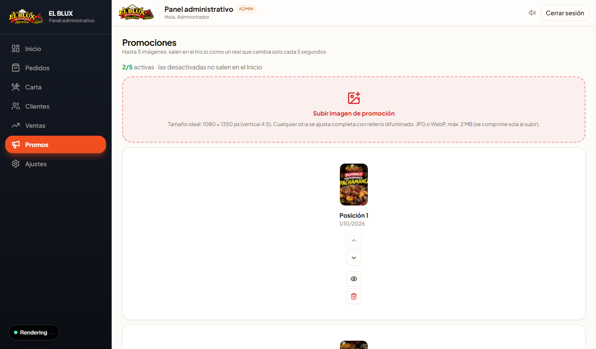

Subes la foto del banner (ideal 1080×1350 vertical, pero cualquier imagen se ajusta sola con fondo difuminado), activas/desactivas y ordenas con las flechas.

## 2.8 Ajustes

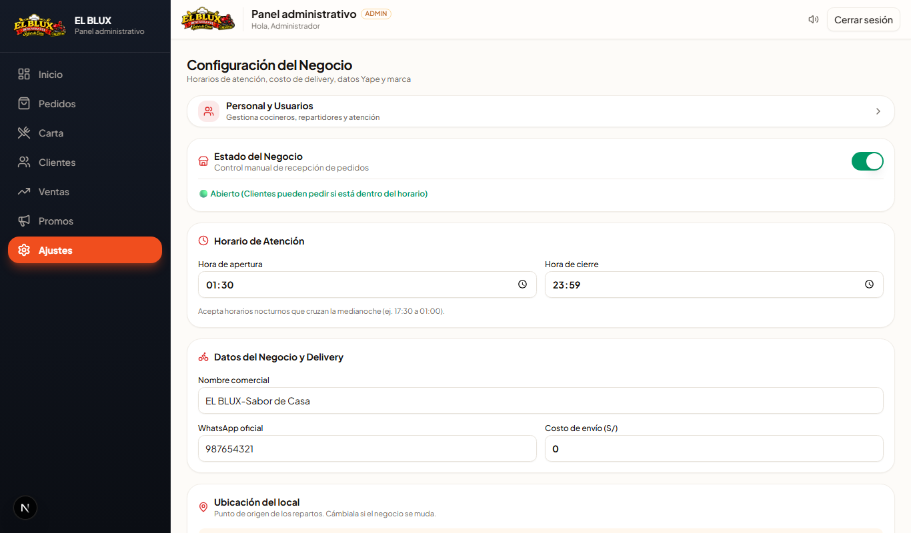

Todo lo clave del negocio:
- **Abrir/Cerrar** manual (encima del horario)
- Horario de atención
- Número y titular de **Yape** + foto del **QR**
- Costo de delivery
- Ubicación del local (para mapas y rutas)
- Logo del restaurante

## 2.9 Personal (Usuarios)

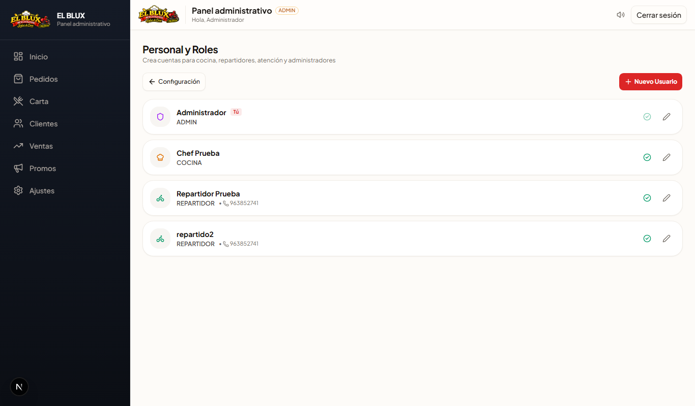

Creas cuentas para cocina, atención y repartidores, y las desactivas cuando dejan de trabajar. (Las contraseñas iniciales las define el admin; si olvidan, se resetean desde aquí con soporte).

---
---

# 👨‍🍳 ROL 3 · COCINA (tablet)

*Entra con su correo en `/admin/login` y va directo a `/cocina`.*

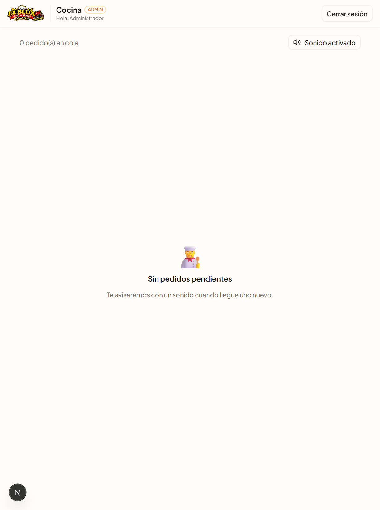

Cocina ve **solo lo que necesita**: nada de precios ni datos del cliente.

- **🆕 Por preparar** — pedidos nuevos confirmados, con los ítems y cantidades
- **🔥 En preparación** — los que ya empezaste
- Suena una **campanita** cuando llega uno nuevo (activa el sonido con el botón de arriba)
- Botón **PREPARAR** → el cliente ve "En preparación 🔥"
- Botón **LISTO** → el pedido pasa a despacho

En tablet/PC grande se ve a dos columnas.

---
---

# 🛵 ROL 4 · REPARTIDOR

*Entra con su correo y todo le sale en su teléfono.*

## 4.1 Hacer la entrega

1. Cuando el admin te asigna un pedido, **aparece al instante** en tu pantalla.
2. Ordena tu ruta con ▲▼.
3. **SALIR A ENTREGAR** → el cliente ya te verá en su mapa.
4. **COMPARTIR MI UBICACIÓN EN VIVO** → acepta el permiso de GPS (punto verde = compartiendo).
5. **VER RUTA** → mapa con la ruta por las calles hasta la casa del cliente (se recalcula solo mientras te mueves).
6. Al entregar: botón **ENTREGADO** ✅.

> Sin GPS del cliente: la tarjeta muestra la dirección y referencia escrita para que te guíes.

## 4.2 Tu caja (efectivo)

Si cobraste pedidos "pagar al recibir" 💵:

- En **Mi caja** ves el total que llevas en efectivo con el detalle por pedido.
- De vuelta al local: botón **ENTREGAR AL LOCAL** → queda *pendiente de confirmación*.
- El admin confirma que recibió el dinero y tu caja queda en cero.

## 4.3 Tu historial

**📋 Mis entregas de hoy**: número de pedido, cliente y monto de cada entrega completada ese día.

---
---

# 📌 ANEXOS

## Reglas de la casa

| Regla | Detalle |
|---|---|
| Número de pedido | Se genera solo, con la hora de Perú |
| Pago Yape | Sin captura no se puede pedir por Yape |
| Cancelación gratis | Solo antes de entrar a cocina |
| Cancelación tarde | Número suspendido + deuda (total + S/5) |
| Repartidor | Puede ser un dedicado o el mismo administrador |
| Horario | Se configura en Ajustes; fuera de horario la tienda se cierra sola |

## Preguntas frecuentes

- **¿Se puede pedir sin instalar nada?** Sí, desde el navegador del celular o la PC.
- **¿Cuánto dura la sesión del personal?** 30 días si marca "Guardar mi sesión"; si no, se cierra al apagar el navegador.
- **¿El cliente recibe notificación cuando su pedido sale?** Puede ver su estado en vivo en su enlace; se evalúa notificaciones por WhatsApp en la siguiente versión.
- **¿Se pueden usar varios repartidores?** Sí, cada uno con su usuario.

## Soporte

Problemas con la app → contacta al administrador del sistema.
Cliente suspendido → paga su deuda por WhatsApp y el admin lo reactiva desde *Clientes*.

---

*© EL BLUX Sabor de Casa — Guía generada con capturas reales del sistema.*
*Última actualización: 2026-10-01*
