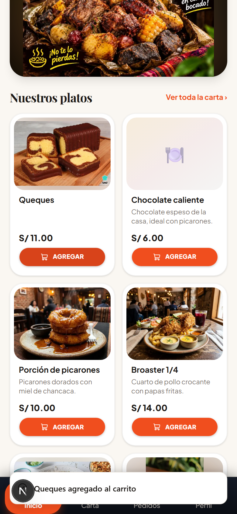
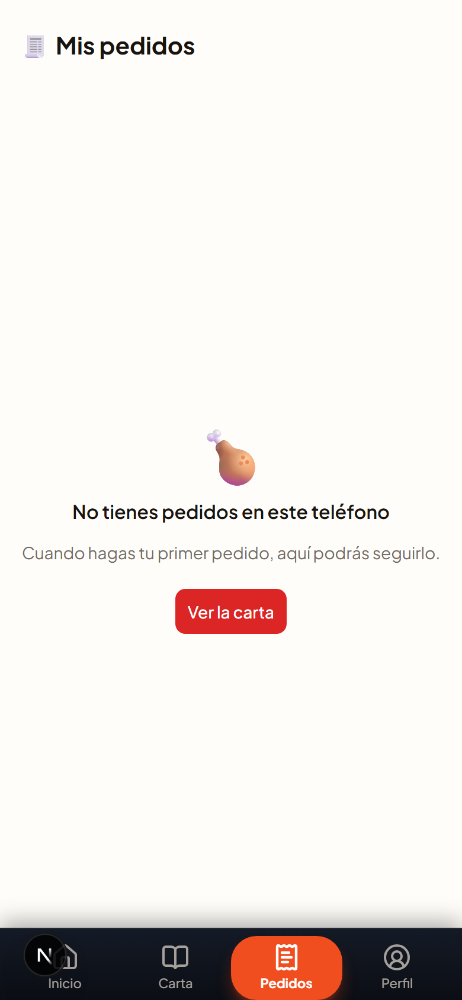
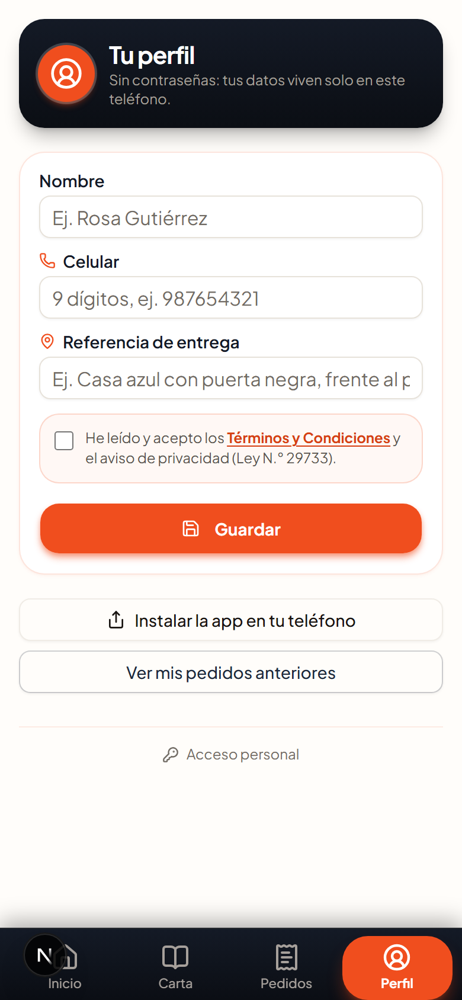
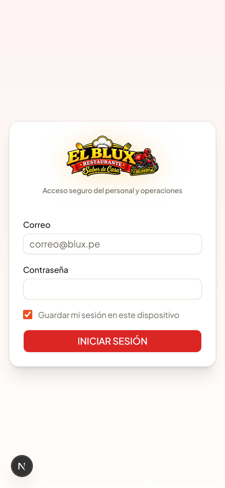
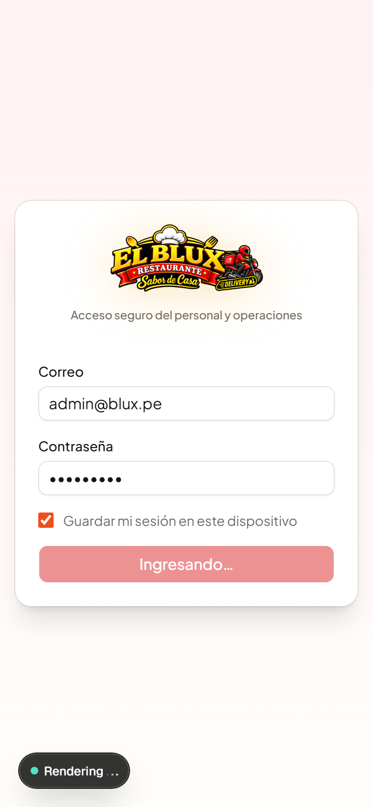
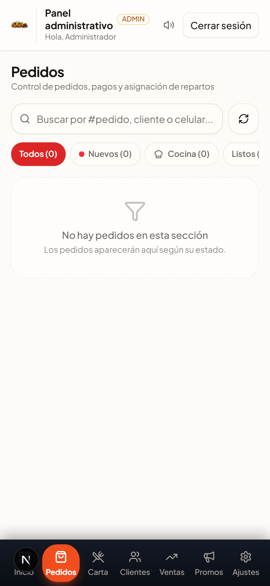
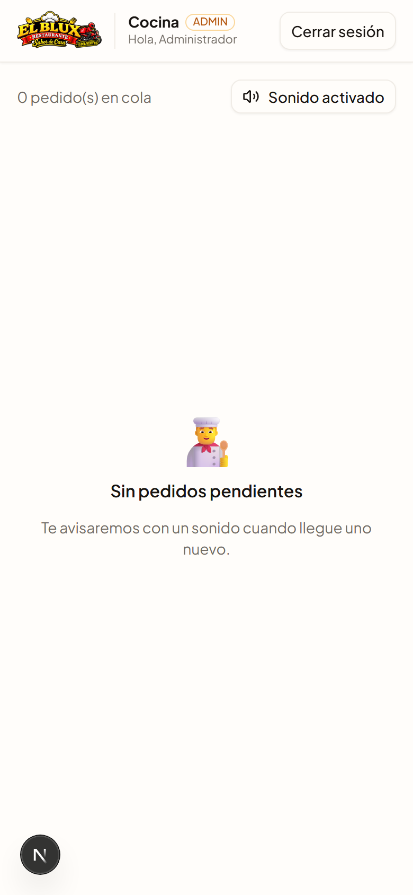
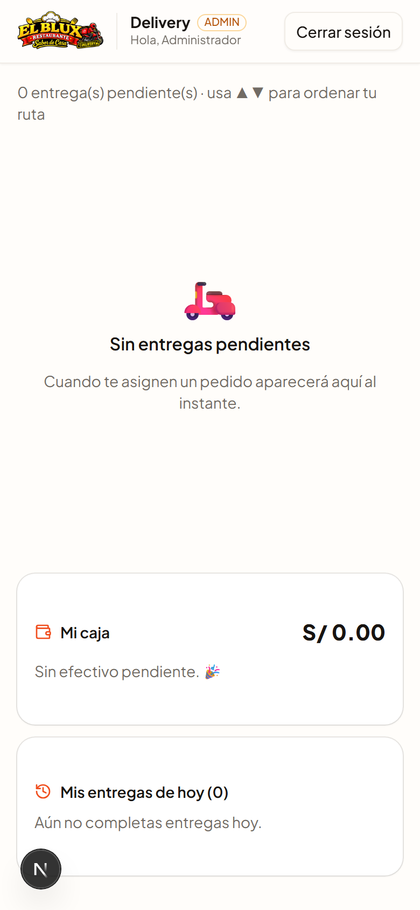

# 📖 Guía de usuario — EL BLUX Sabor de Casa

La app tiene **dos partes**:

1. **🍗 Zona del cliente** (sin cuenta, sin contraseña): pedir, pagar y seguir el delivery.
2. **🔐 Zona del personal** (con correo y contraseña): administrador, cocina y repartidor.

---

# 🍗 PARTE 1 — El cliente pide su comida

## 1. Inicio

Al abrir el enlace de la app verás la portada con las promociones del día, el buscador y los platos.

| Elemento | Qué hace |
|---|---|
| 🔘 **Abierto / Cerrado** | Muestra el horario de atención. Si está cerrado, no se puede pedir. |
| 🔍 **Buscador** | Escribe "caldo", "mostrito", etc. y filtra al instante. |
| 🍴 **Categorías** | Toca para ver solo caldos, mostritos, postres… |
| 🎠 **Banner de promociones** | Fotos de la promo del día. Toca izquierda/derecha para pasarlas, mantén presionado para pausar. |
| 🔗 **Botón compartir** (naranja, junto al buscador) | Envía la carta por WhatsApp a tus contactos. |

## 2. La Carta

Toca **Carta** en la barra de abajo (📖). Verás todos los platos con foto, precio y descripción.

## 3. Agregar al carrito

En Inicio o en la Carta, toca el botón naranja **🛒 Agregar** del plato que quieras. Arriba a la derecha, el ícono del carrito te dice cuántos llevas.

## 4. Revisar el carrito

Toca el ícono 🛒 (arriba a la derecha). Ahí puedes:
- Subir o bajar cantidades de cada plato (＋ / −)
- Eliminar un plato
- Ver el total con delivery
- Tocar **"Ir a pagar"**

## 5. Completar el pedido (checkout)

Llena estos datos:

1. **👤 Tu nombre y celular** (9 dígitos, empieza en 9). Se guardan en tu teléfono para no escribirlos otra vez.
2. **📍 Ubicación**: toca "USAR MI UBICACIÓN" (acepta el permiso) y escribe la **referencia de tu casa** (obligatoria).
3. **💳 Pago**:
   - **Yape** 💜: transfiere el total y sube la **captura del Yape** (galería o foto).
   - **Pagar al recibir** 💵: pagas en efectivo cuando llega el repartidor.
4. **✅ Marca la casilla** de Términos y Condiciones.
5. Toca **CONFIRMAR PEDIDO**.

> ⚠️ Si una vez **cancelaste un pedido que ya se estaba preparando**, tu número queda suspendido y verás el mensaje en rojo con el monto a pagar para reactivarlo.

## 6. Seguir tu pedido en vivo

Al confirmar, toca **"Ver estado de mi pedido"**. Guarda ese enlace (se queda en **Mis pedidos** también).

Verás el estado cambiar en tiempo real:

**🆕 Recibido → ✅ Confirmado → 🔥 En preparación → ✅ Listo → 🛵 Asignado → 🛵 En camino → 🎉 Entregado**

Cuando el pedido esté asignado verás la **tarjeta de tu repartidor** con su nombre y un botón **💬 Chatear** (WhatsApp). Cuando salga en camino verás **su moto en el mapa en vivo** y el tiempo estimado de llegada.

Desde ahí también puedes **⛔ Cancelar el pedido**:
- Si aún **no está en preparación** → gratis, sin problema.
- Si ya está **en preparación o después** → tu número queda suspendido y pagas el gasto + S/5 de reactivación.

## 7. Perfil e instalación

En **Perfil** (barra inferior):
- Ver/editar tu nombre, celular y referencia (botón **Modificar** → **Guardar**)
- **📲 Instalar la app** en tu teléfono (aparece como ícono en tu pantalla de inicio, como cualquier app)
- Ver tus **pedidos anteriores**

---

# 🔐 PARTE 2 — El personal

Entra desde el enlace **"Acceso personal"** (abajo en Perfil) o directo a `/admin/login`.

Cada rol entra con su correo y contraseña, y al entrar queda registrada la sesión si marcas **"Guardar mi sesión"**.

## A) Administrador

### Inicio del panel
Resumen del día y la tarjeta **"Efectivo por recibir"** (rendiciones de dinero de los repartidores → toca **Recibí** cuando te entreguen).

### Pedidos
Gestiona todo: cambiar estados (Confirmar → En preparación → Listo), **verificar pagos Yape** (ver la captura), **asignar repartidor**, y ver dentro del pedido quién lo entregó y su WhatsApp.

- En **computadora**: navegas por la barra oscura de la izquierda (Inicio, Pedidos, Carta, Clientes, Ventas, Promos, Ajustes).
- En **celular**: naranja abajo.

### Otros módulos
- **Carta**: subir platos, precios, fotos; marcar agotado.
- **Clientes**: historial de cada cliente; si canceló y quedó suspendido, ahí lo **reactivas** cuando pague.
- **Ventas**: resumen de ventas del día.
- **Promos**: sube las fotos del banner (formato vertical 1080×1350 o cualquiera, se ajusta sola).
- **Ajustes**: horario, ubicación del local, Yape, abrir/cerrar el negocio.

## B) Cocina (tablet)

Solo ve lo que prepara: **🆕 Por preparar** y **🔥 En preparación**, con los ítems de cada pedido. Suena una campanita cuando llega un pedido nuevo (activa el sonido con el botón de arriba).

- **PREPARAR** → marca que empezaste.
- **LISTO** → avisa al repartidor/admin.

## C) Repartidor

Ve solo sus entregas asignadas, en orden:

1. **SALIR A ENTREGAR** → el cliente empieza a verte en el mapa.
2. **COMPARTIR MI UBICACIÓN EN VIVO** → activa tu GPS (acepta el permiso).
3. **VER RUTA** → mapa con la ruta por las calles hasta la casa del cliente.
4. **ENTREGADO** → marca la entrega.
5. **💵 Mi caja**: cuánto efectivo (de pedidos "pagar al recibir") llevas encima → botón **"ENTREGAR AL LOCAL"**. El admin confirma que lo recibió.
6. **📋 Mis entregas de hoy**: tu historial del día.

---

# ❓ Preguntas frecuentes

| Pregunta | Respuesta |
|---|---|
| ¿El cliente necesita cuenta? | No. Solo su nombre, celular y referencia. |
| El cliente borró la app, ¿qué pasa con sus pedidos? | Los pedidos se ven por el enlace o en "Mis pedidos" si aún tiene la app. Los viejos borrados de la base se limpian solos. |
| Cliente canceló y no puede pedir | Está suspendido: te escribe por WhatsApp, te paga (pedido + S/5) y lo reactivas en **Clientes**. |
| ¿Dónde veo el dinero de Yape? | En el pedido, validas la captura. El contra-entrega lo rinde el repartidor en "Mi caja". |
| ¿Se puede usar en computadora? | Sí: la zona de administración y cocina están optimizadas para PC/tablet. La tienda del cliente está pensada para el celular. |
| ¿Cuántos pedidos aguanta? | Cientos al día sin problemas (Vercel/Supabase aguantan de sobra tu escala actual). |

---

*Guía generada automáticamente con capturas reales de la app. Última actualización: 2026-10-01.*
